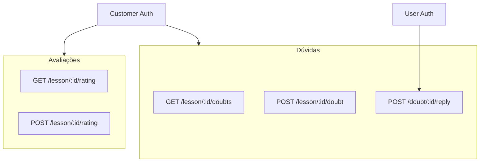

# Rotas de API Necessárias para Dúvidas e Avaliações nas Aulas

Este documento lista as rotas de API que precisam ser adicionadas ao backend Profissão Laser para que o chat de dúvidas e o sistema de avaliações por estrelas funcionem integralmente nas páginas de curso.

**Base URL**: `NEXT_PUBLIC_API_URL` (configurado em `.env`)

**Autenticação**: Todas as rotas requerem token Bearer do **customer** (aluno logado com acesso ao curso). A rota de resposta a dúvidas requer token de **user** (instrutor/admin).

---

## Resumo por Recurso

| Recurso   | Rotas necessárias                         | Recurso UI                    |
|-----------|--------------------------------------------|-------------------------------|
| Dúvidas   | GET /lesson/{id}/doubts                    | Lista dúvidas na aba          |
| Dúvida    | POST /lesson/{id}/doubt                    | Enviar dúvida                 |
| Resposta  | POST /doubt/{id}/reply                    | Responder dúvida (admin)      |
| Avaliação | GET, POST /lesson/{id}/rating              | Estrelas de avaliação da aula |

---

## Detalhamento das Rotas

### 1. Dúvidas (Listar)

| Método | Rota                      | Descrição                    | Body / Params |
|--------|---------------------------|------------------------------|---------------|
| GET    | /lesson/{lessonId}/doubts | Lista dúvidas da aula        | Query: `?page=1&limit=20` (opcional) |

**Resposta**: Array de objetos com a estrutura abaixo.

```json
[
  {
    "id": "uuid",
    "content": "Como configuro o EZCAD para corte em acrílico?",
    "authorName": "João Silva",
    "authorEmail": "joao@email.com",
    "createdAt": "2026-03-03T14:30:00.000Z",
    "replies": [
      {
        "id": "uuid",
        "content": "Vá em Configurações > Material e selecione Acrílico.",
        "authorName": "Instrutor",
        "createdAt": "2026-03-03T15:00:00.000Z",
        "isInstructor": true
      }
    ]
  }
]
```

| Campo       | Tipo   | Descrição                          |
|-------------|--------|------------------------------------|
| id          | string | UUID da dúvida                     |
| content     | string | Texto da dúvida                    |
| authorName  | string | Nome do autor (customer)           |
| authorEmail | string | Email do autor (pode omitir por privacidade) |
| createdAt   | string | ISO 8601                           |
| replies     | array  | Respostas (instrutor ou admin)      |

---

### 2. Dúvida (Criar)

| Método | Rota                      | Descrição                    | Body / Params |
|--------|---------------------------|------------------------------|---------------|
| POST   | /lesson/{lessonId}/doubt  | Criar nova dúvida sobre a aula | `{ content: string }` |

**Body (JSON)**:

```json
{
  "content": "Escreva sua dúvida aqui..."
}
```

| Campo   | Tipo   | Obrigatório | Descrição        |
|---------|--------|-------------|------------------|
| content | string | Sim         | Texto da dúvida  |

**Resposta**: Objeto da dúvida criada (mesma estrutura do item da lista, sem `replies` ou com `replies: []`).

**Validação**: O customer deve ter acesso ao curso que contém a aula (plano ativo com feature `chat`).

---

### 3. Resposta a Dúvida (Instrutor/Admin)

| Método | Rota                   | Descrição                    | Body / Params |
|--------|------------------------|------------------------------|---------------|
| POST   | /doubt/{doubtId}/reply  | Responder a uma dúvida        | `{ content: string }` |

**Body (JSON)**:

```json
{
  "content": "Vá em Configurações > Material e selecione Acrílico."
}
```

| Campo   | Tipo   | Obrigatório | Descrição         |
|---------|--------|-------------|-------------------|
| content | string | Sim         | Texto da resposta |

**Resposta**: Objeto da resposta criada com `id`, `content`, `authorName`, `createdAt`, `isInstructor: true`.

**Autorização**: Apenas utilizadores com role `user` (instrutor/admin) podem responder.

---

### 4. Avaliação (Obter)

| Método | Rota                      | Descrição                    | Body / Params |
|--------|---------------------------|------------------------------|---------------|
| GET    | /lesson/{lessonId}/rating | Obter avaliação do customer e média da aula | — |

**Resposta**:

```json
{
  "myRating": 4,
  "averageRating": 4.2,
  "totalRatings": 15
}
```

| Campo         | Tipo   | Descrição                                      |
|---------------|--------|------------------------------------------------|
| myRating      | number | Avaliação do customer (1-5) ou `null` se não avaliou |
| averageRating | number | Média das avaliações da aula (1-5)             |
| totalRatings  | number | Número total de avaliações                     |

Se o customer não tiver avaliado, `myRating` deve ser `null`.

---

### 5. Avaliação (Submeter)

| Método | Rota                      | Descrição                    | Body / Params |
|--------|---------------------------|------------------------------|---------------|
| POST   | /lesson/{lessonId}/rating | Submeter ou atualizar avaliação | `{ stars: number }` |

**Body (JSON)**:

```json
{
  "stars": 4
}
```

| Campo | Tipo   | Obrigatório | Descrição                    |
|-------|--------|-------------|------------------------------|
| stars | number | Sim         | Valor de 1 a 5 (estrelas)    |

**Resposta**: Objeto com `myRating`, `averageRating`, `totalRatings` (mesma estrutura do GET).

**Comportamento**: Se o customer já tiver avaliado, a avaliação é atualizada (upsert por `lessonId` + `customerId`).

---

## Mapeamento Frontend → API

| Componente / Funcionalidade     | Rota API                      |
|--------------------------------|-------------------------------|
| Lista de dúvidas               | GET /lesson/{lessonId}/doubts |
| Enviar dúvida (botão)          | POST /lesson/{lessonId}/doubt |
| Responder dúvida (admin)       | POST /doubt/{doubtId}/reply   |
| Carregar rating + média        | GET /lesson/{lessonId}/rating|
| Avaliar com estrelas (click)   | POST /lesson/{lessonId}/rating|

---

## Tabelas Sugeridas

### lesson_doubts

```sql
CREATE TABLE lesson_doubts (
  id UUID PRIMARY KEY DEFAULT gen_random_uuid(),
  lesson_id UUID NOT NULL REFERENCES lessons(id) ON DELETE CASCADE,
  customer_id UUID NOT NULL REFERENCES customers(id) ON DELETE CASCADE,
  content TEXT NOT NULL,
  created_at TIMESTAMPTZ DEFAULT NOW()
);

CREATE INDEX idx_lesson_doubts_lesson ON lesson_doubts(lesson_id);
CREATE INDEX idx_lesson_doubts_customer ON lesson_doubts(customer_id);
CREATE INDEX idx_lesson_doubts_created ON lesson_doubts(created_at DESC);
```

### lesson_doubt_replies

```sql
CREATE TABLE lesson_doubt_replies (
  id UUID PRIMARY KEY DEFAULT gen_random_uuid(),
  doubt_id UUID NOT NULL REFERENCES lesson_doubts(id) ON DELETE CASCADE,
  user_id UUID NOT NULL REFERENCES users(id) ON DELETE CASCADE,
  content TEXT NOT NULL,
  created_at TIMESTAMPTZ DEFAULT NOW()
);

CREATE INDEX idx_doubt_replies_doubt ON lesson_doubt_replies(doubt_id);
```

### lesson_ratings

```sql
CREATE TABLE lesson_ratings (
  id UUID PRIMARY KEY DEFAULT gen_random_uuid(),
  lesson_id UUID NOT NULL REFERENCES lessons(id) ON DELETE CASCADE,
  customer_id UUID NOT NULL REFERENCES customers(id) ON DELETE CASCADE,
  stars SMALLINT NOT NULL CHECK (stars >= 1 AND stars <= 5),
  created_at TIMESTAMPTZ DEFAULT NOW(),
  updated_at TIMESTAMPTZ DEFAULT NOW(),
  UNIQUE(lesson_id, customer_id)
);

CREATE INDEX idx_lesson_ratings_lesson ON lesson_ratings(lesson_id);
CREATE INDEX idx_lesson_ratings_customer ON lesson_ratings(customer_id);
```

---

## Fluxo



1. O aluno (customer) acede à página do curso e seleciona uma aula.
2. Na aba **Dúvidas**: o frontend chama `GET /lesson/{lessonId}/doubts` para listar; ao clicar "Enviar dúvida", chama `POST /lesson/{lessonId}/doubt`.
3. Na **Avaliação**: o frontend chama `GET /lesson/{lessonId}/rating` ao carregar; ao clicar numa estrela, chama `POST /lesson/{lessonId}/rating`.
4. O instrutor (user) responde a dúvidas via `POST /doubt/{doubtId}/reply`.

---

## Notas de Implementação

1. **Autorização**: Validar que o customer tem plano ativo com classe que possui `chat: true` antes de permitir criar/listar dúvidas. A mesma validação aplica-se às avaliações.

2. **Acesso à aula**: Verificar que o customer tem acesso ao produto/curso que contém a aula (via purchases/subscriptions) antes de qualquer operação.

3. **Paginação**: A rota `GET /lesson/{lessonId}/doubts` deve suportar `?page=1&limit=20` para escalar em aulas com muitas dúvidas.

4. **Nomes de autores**: Para `authorName` nas dúvidas, usar o nome do customer (tabela `customers`). Para respostas, usar o nome do user (tabela `users`).

5. **Frontend**: O cliente `api` em `src/lib/fetch.ts` envia automaticamente o Bearer token; o backend deve distinguir customer vs user pelo payload do JWT (role/claim).
