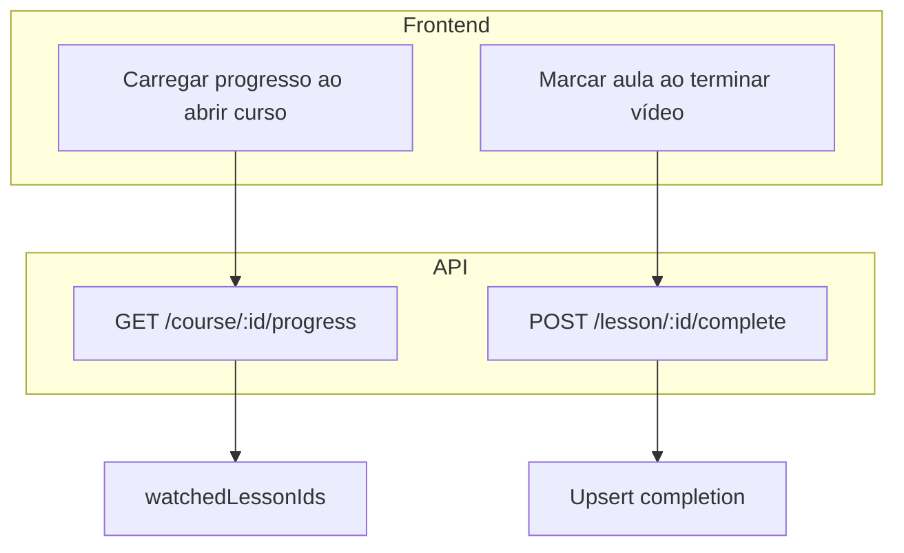

# Rotas de API Necessárias para Progresso de Aulas (Assistidas)

Este documento lista as rotas de API que precisam ser adicionadas ao backend Profissão Laser para que o progresso de aulas (marcar como assistidas) funcione de forma persistente entre dispositivos. O frontend usa atualmente `localStorage` como fallback; quando estas rotas existirem, o serviço será atualizado para usar a API como fonte de verdade.

**Base URL**: `NEXT_PUBLIC_API_URL` (configurado em `.env`)

**Autenticação**: Todas as rotas requerem token Bearer do **customer** (aluno logado com acesso ao curso).

---

## Resumo por Recurso

| Recurso   | Rotas necessárias                    | Recurso UI                          |
|-----------|--------------------------------------|-------------------------------------|
| Progresso | GET /course/{courseId}/progress      | Carregar aulas já assistidas        |
| Progresso | POST /lesson/{lessonId}/complete     | Marcar aula como assistida          |

---

## Detalhamento das Rotas

### 1. Obter Progresso do Curso

| Método | Rota                           | Descrição                          | Body / Params |
|--------|--------------------------------|------------------------------------|---------------|
| GET    | /course/{courseId}/progress    | Lista IDs das aulas já assistidas  | —             |

**Resposta**:

```json
{
  "watchedLessonIds": ["uuid-1", "uuid-2", "uuid-3"]
}
```

| Campo            | Tipo   | Descrição                          |
|------------------|--------|------------------------------------|
| watchedLessonIds | array  | IDs das aulas que o customer já assistiu até ao fim |

**Validação**: O customer deve ter acesso ao curso (plano ativo, compra ou subscrição).

---

### 2. Marcar Aula como Assistida

| Método | Rota                            | Descrição                          | Body / Params |
|--------|---------------------------------|------------------------------------|---------------|
| POST   | /lesson/{lessonId}/complete      | Marcar aula como assistida         | —             |

**Body**: Nenhum (ou `{}` vazio).

**Resposta**:

```json
{
  "lessonId": "uuid",
  "completedAt": "2026-03-03T14:30:00.000Z"
}
```

| Campo       | Tipo   | Descrição                          |
|-------------|--------|------------------------------------|
| lessonId    | string | UUID da aula                       |
| completedAt | string | ISO 8601 do momento da conclusão   |

**Comportamento**: Idempotente — chamar várias vezes para a mesma aula não deve criar duplicados. O backend deve fazer upsert por `lessonId` + `customerId`.

**Validação**: O customer deve ter acesso ao curso que contém a aula.

---

## Mapeamento Frontend → API

| Componente / Funcionalidade     | Rota API                          |
|--------------------------------|-----------------------------------|
| Carregar progresso ao abrir curso | GET /course/{courseId}/progress |
| Marcar aula ao terminar vídeo  | POST /lesson/{lessonId}/complete   |

---

## Tabela Sugerida

### customer_lesson_completions

```sql
CREATE TABLE customer_lesson_completions (
  id UUID PRIMARY KEY DEFAULT gen_random_uuid(),
  customer_id UUID NOT NULL REFERENCES customers(id) ON DELETE CASCADE,
  lesson_id UUID NOT NULL REFERENCES lessons(id) ON DELETE CASCADE,
  completed_at TIMESTAMPTZ DEFAULT NOW(),
  UNIQUE(customer_id, lesson_id)
);

CREATE INDEX idx_lesson_completions_customer ON customer_lesson_completions(customer_id);
CREATE INDEX idx_lesson_completions_lesson ON customer_lesson_completions(lesson_id);
```

---

## Fluxo



1. Ao abrir a página do curso, o frontend chama `GET /course/{courseId}/progress` para obter as aulas já assistidas e exibir o ícone de check na listagem.
2. Quando o vídeo termina (evento `ended`), o frontend chama `POST /lesson/{lessonId}/complete` para persistir e avança para a próxima aula.

---

## Notas de Implementação

1. **Autorização**: Validar que o customer tem acesso ao curso (via purchases/subscriptions) antes de qualquer operação.

2. **Merge com localStorage**: Quando a API existir, o frontend pode usar os dados do localStorage como cache inicial enquanto carrega a API, e depois sincronizar. O backend é a fonte de verdade.

3. **Definição de "assistida"**: Considerar assistida quando o utilizador vê o vídeo até ao fim (evento `ended`). O frontend já implementa esta lógica e chama o callback apenas nesse momento.
