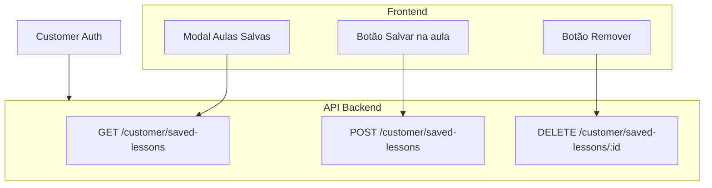

# Rotas de API Necessárias para Aulas Salvas

Este documento lista as rotas de API que precisam ser implementadas no backend Profissão Laser para que a funcionalidade de **Aulas Salvas** funcione integralmente no frontend.

**Base URL**: `NEXT_PUBLIC_API_URL` (configurado em `.env`)

**Autenticação**: Todas as rotas requerem token Bearer do **customer** (aluno logado). O customer é identificado via JWT (sub/email).

**Estado do frontend**: O frontend já está implementado em `src/services/saved-lessons.ts` e aguarda estas rotas no backend.

---

## Resumo das Rotas

| Método | Rota | Descrição |
|--------|------|------------|
| GET | /customer/saved-lessons | Listar aulas salvas do customer |
| POST | /customer/saved-lessons | Salvar uma aula |
| DELETE | /customer/saved-lessons/{lessonId} | Remover aula das salvas |

---

## 1. GET /customer/saved-lessons (listar aulas salvas)

Lista todas as aulas que o customer guardou como favoritas.

**Resposta 200**:

```json
[
  {
    "id": "uuid",
    "lessonId": "uuid",
    "lesson": {
      "id": "uuid",
      "title": "Instalando o Ezcad",
      "duration": 120,
      "videoUrl": "https://..."
    },
    "courseSlug": "fiber-laser-ezcad",
    "courseName": "Fiber Laser EZCAD - Básico ao Avançado"
  }
]
```

| Campo | Tipo | Descrição |
|-------|------|------------|
| id | string | UUID do registo de aula salva |
| lessonId | string | UUID da aula |
| lesson | object | Dados da aula (id, title, duration, videoUrl) |
| courseSlug | string | Slug do curso (para navegação) |
| courseName | string | Nome do curso |

**Erros**: 401 (não autenticado)

---

## 2. POST /customer/saved-lessons (salvar aula)

Adiciona uma aula à lista de aulas salvas do customer.

**Body (JSON)**:

```json
{
  "lessonId": "uuid-da-aula"
}
```

| Campo | Tipo | Obrigatório | Descrição |
|-------|------|-------------|-----------|
| lessonId | string | Sim | UUID da aula a guardar |

**Resposta 201**:

```json
{
  "id": "uuid",
  "lessonId": "uuid",
  "lesson": {
    "id": "uuid",
    "title": "Instalando o Ezcad",
    "duration": 120,
    "videoUrl": "https://..."
  },
  "courseSlug": "fiber-laser-ezcad",
  "courseName": "Fiber Laser EZCAD - Básico ao Avançado"
}
```

**Validação**: O customer deve ter acesso ao curso que contém a aula (plano ativo) antes de permitir salvar.

**Erros**: 400 (lessonId inválido ou aula inexistente), 401, 403 (sem acesso ao curso), 409 (aula já salva)

---

## 3. DELETE /customer/saved-lessons/{lessonId} (remover aula salva)

Remove uma aula da lista de aulas salvas do customer.

**Path params**: `lessonId` (UUID da aula)

**Resposta 204**: No content

**Erros**: 401, 404 (aula não estava nas salvas ou não pertence ao customer)

---

## Mapeamento Frontend → API

| Componente / Funcionalidade | Rota API |
|----------------------------|----------|
| Modal "Minhas Aulas Salvas" (lista) | GET /customer/saved-lessons |
| Botão "Salvar" na aula | POST /customer/saved-lessons |
| Botão "Remover" no modal | DELETE /customer/saved-lessons/{lessonId} |

---

## Tabela Sugerida

### customer_saved_lessons

```sql
CREATE TABLE customer_saved_lessons (
  id UUID PRIMARY KEY DEFAULT gen_random_uuid(),
  customer_id UUID NOT NULL REFERENCES customers(id) ON DELETE CASCADE,
  lesson_id UUID NOT NULL REFERENCES lessons(id) ON DELETE CASCADE,
  created_at TIMESTAMPTZ DEFAULT NOW(),
  UNIQUE(customer_id, lesson_id)
);

CREATE INDEX idx_saved_lessons_customer ON customer_saved_lessons(customer_id);
CREATE INDEX idx_saved_lessons_lesson ON customer_saved_lessons(lesson_id);
```

---

## Fluxo



1. O aluno acede à página do curso e clica no botão **Aulas Salvas** no header → o modal abre e chama `GET /customer/saved-lessons`.
2. Ao clicar no ícone de bookmark numa aula → chama `POST /customer/saved-lessons` com `{ lessonId }`.
3. No modal, ao clicar **Remover** numa aula → chama `DELETE /customer/saved-lessons/{lessonId}`.
4. Ao clicar **Assistir** no modal → navega para `/course/{courseSlug}?lesson={lessonId}`.

---

## Notas de Implementação

1. **Autorização**: Validar que o customer tem plano ativo com acesso ao curso que contém a aula antes de permitir salvar.

2. **Acesso à aula**: O customer só pode salvar aulas de cursos aos quais tem acesso (via purchases/subscriptions).

3. **Idempotência**: Se o customer tentar salvar uma aula já salva, o backend pode retornar 200/201 com o registo existente ou 409 (Conflict).

4. **Dados da aula**: Na resposta do GET e POST, incluir `lesson` com `id`, `title`, `duration`, `videoUrl` e `courseSlug`/`courseName` para o frontend exibir a lista sem chamadas adicionais.

5. **Frontend**: O cliente `api` em `src/lib/fetch.ts` envia automaticamente o Bearer token. O backend identifica o customer pelo payload do JWT.
