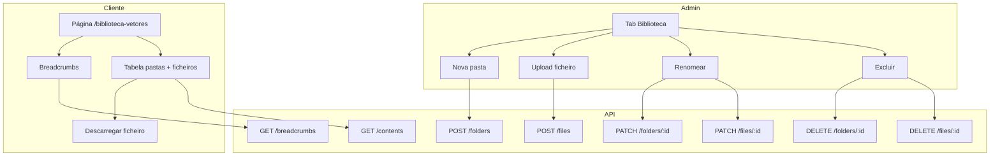

# Rotas de API para Biblioteca de Vetores

Este documento lista as rotas de API necessárias no backend **Profissão Laser** para suportar a Biblioteca de Vetores com estrutura hierárquica de pastas e ficheiros.

**Base URL**: `NEXT_PUBLIC_API_URL` (configurado em `.env`)

**Autenticação**: As rotas de escrita (POST, PATCH, DELETE) exigem autenticação de utilizador admin. A rota GET pode ser acessível a clientes com plano que inclui `vetorizacao`.

---

## Resumo

| Método | Rota | Descrição | Quem |
|--------|------|-----------|------|
| GET | /community/vector-library/contents?parentId= | Listar pastas + ficheiros numa pasta | Cliente / Admin |
| GET | /community/vector-library/breadcrumbs?folderId= | Obter caminho de breadcrumbs | Cliente / Admin |
| POST | /community/vector-library/folders | Criar pasta | Admin |
| PATCH | /community/vector-library/folders/{id} | Renomear pasta | Admin |
| DELETE | /community/vector-library/folders/{id} | Excluir pasta (recursivo) | Admin |
| POST | /community/vector-library/files | Upload ficheiro | Admin |
| PATCH | /community/vector-library/files/{id} | Renomear ficheiro | Admin |
| DELETE | /community/vector-library/files/{id} | Excluir ficheiro | Admin |

---

## Detalhamento

### 1. GET /community/vector-library/contents (listar conteúdo)

Lista pastas e ficheiros numa pasta. `parentId` null ou omitido = raiz.

**Query params**:
- `parentId` (opcional): UUID da pasta pai. Omitir ou enviar vazio para raiz.

**Resposta 200**:

```json
{
  "folders": [
    {
      "id": "uuid",
      "name": "Pack 134 Vetores 360",
      "parentId": null,
      "order": 0,
      "createdAt": "2024-01-19T14:00:00Z"
    }
  ],
  "files": [
    {
      "id": "uuid",
      "name": "AGRO_01.svg",
      "folderId": "uuid",
      "fileUrl": "https://...",
      "mimeType": "image/svg+xml",
      "size": 1572864,
      "createdAt": "2025-02-02T10:00:00Z",
      "order": 0
    }
  ]
}
```

| Campo (folder) | Tipo | Descrição |
|----------------|------|-----------|
| id | string | UUID da pasta |
| name | string | Nome da pasta |
| parentId | string \| null | UUID da pasta pai (null = raiz) |
| order | number | Ordem de exibição |
| createdAt | string | ISO 8601 |

| Campo (file) | Tipo | Descrição |
|--------------|------|-----------|
| id | string | UUID do ficheiro |
| name | string | Nome do ficheiro |
| folderId | string \| null | UUID da pasta (null = raiz) |
| fileUrl | string | URL do ficheiro |
| mimeType | string | MIME type |
| size | number | Tamanho em bytes (opcional) |
| createdAt | string | ISO 8601 |
| order | number | Ordem de exibição |

**Erros**: 401 (não autenticado)

---

### 2. GET /community/vector-library/breadcrumbs (breadcrumbs)

Retorna o caminho de breadcrumbs até uma pasta.

**Query params**:
- `folderId` (opcional): UUID da pasta atual. Omitir para raiz.

**Resposta 200**:

```json
[
  { "id": null, "name": "Biblioteca" },
  { "id": "uuid-1", "name": "Pack 134 Vetores 360" },
  { "id": "uuid-2", "name": "Logos" }
]
```

**Erros**: 401

---

### 3. POST /community/vector-library/folders (criar pasta)

Cria uma nova pasta.

**Body** (JSON):

| Campo | Tipo | Obrigatório | Descrição |
|-------|------|-------------|-----------|
| name | string | Sim | Nome da pasta |
| parentId | string \| null | Sim | UUID da pasta pai (null para raiz) |

```json
{
  "name": "Nova Pasta",
  "parentId": null
}
```

**Resposta 201**: Objeto `VectorLibraryFolder` criado

**Erros**: 400 (nome vazio), 401, 403 (não admin), 404 (parentId inexistente)

---

### 4. PATCH /community/vector-library/folders/{id} (renomear pasta)

Renomeia uma pasta.

**Path params**: `id` - UUID da pasta

**Body** (JSON):

| Campo | Tipo | Obrigatório | Descrição |
|-------|------|-------------|-----------|
| name | string | Sim | Novo nome |

**Resposta 200**: Objeto `VectorLibraryFolder` atualizado

**Erros**: 400, 401, 403, 404

---

### 5. DELETE /community/vector-library/folders/{id} (excluir pasta)

Exclui uma pasta e todo o seu conteúdo (pastas e ficheiros recursivamente).

**Path params**: `id` - UUID da pasta

**Resposta 204**: No content

**Erros**: 401, 403, 404

---

### 6. POST /community/vector-library/files (upload ficheiro)

Cria um novo ficheiro (upload). Aceita qualquer tipo de ficheiro.

**Body** (multipart/form-data):

| Campo | Tipo | Obrigatório | Descrição |
|-------|------|-------------|-----------|
| file | File | Sim | Ficheiro (qualquer tipo) |
| folderId | string | Não | UUID da pasta (omitir para raiz) |
| name | string | Não | Nome customizado (omitir para usar nome do ficheiro) |

**Resposta 201**: Objeto `VectorLibraryFile` criado

**Validação**:
- `file`: max 50MB (ajustável)
- `name`: max 255 caracteres

**Erros**: 400 (ficheiro inválido), 401, 403, 404 (folderId inexistente)

---

### 7. PATCH /community/vector-library/files/{id} (renomear ficheiro)

Renomeia um ficheiro.

**Path params**: `id` - UUID do ficheiro

**Body** (JSON):

| Campo | Tipo | Obrigatório | Descrição |
|-------|------|-------------|-----------|
| name | string | Sim | Novo nome |

**Resposta 200**: Objeto `VectorLibraryFile` atualizado

**Erros**: 400, 401, 403, 404

---

### 8. DELETE /community/vector-library/files/{id} (excluir ficheiro)

Exclui um ficheiro.

**Path params**: `id` - UUID do ficheiro

**Resposta 204**: No content

**Erros**: 401, 403, 404

---

## Tipos (referência)

```typescript
interface VectorLibraryFolder {
  id: string;
  name: string;
  parentId: string | null;
  order: number;
  createdAt: string;
}

interface VectorLibraryFile {
  id: string;
  name: string;
  folderId: string | null;
  fileUrl: string;
  mimeType: string;
  size?: number;
  createdAt: string;
  order: number;
}
```

---

## Mapeamento Frontend → API

| Componente | Serviço | Rota API |
|------------|---------|----------|
| Listar conteúdo | getFolderContents() | GET /community/vector-library/contents?parentId= |
| Breadcrumbs | getBreadcrumbPath() | GET /community/vector-library/breadcrumbs?folderId= |
| Criar pasta | createFolder() | POST /community/vector-library/folders |
| Renomear pasta | updateFolder() | PATCH /community/vector-library/folders/{id} |
| Excluir pasta | deleteFolder() | DELETE /community/vector-library/folders/{id} |
| Upload ficheiro | createFile() | POST /community/vector-library/files |
| Renomear ficheiro | updateFile() | PATCH /community/vector-library/files/{id} |
| Excluir ficheiro | deleteFile() | DELETE /community/vector-library/files/{id} |

---

## Notas de Implementação

1. **Autorização**: Validar que o utilizador tem permissão de admin para POST, PATCH e DELETE.

2. **Armazenamento de ficheiros**: O backend deve aceitar upload via multipart/form-data, salvar em storage (S3, Cloud Storage, etc.) e retornar o `fileUrl` na resposta.

3. **Ordenação**: O campo `order` pode ser gerado automaticamente (max + 1) ao criar. O GET pode retornar ordenado por `order` ou por `name`.

4. **Exclusão recursiva**: Ao excluir uma pasta, excluir primeiro todos os ficheiros e subpastas (em ordem).

5. **Acesso do cliente**: O cliente só pode ver a biblioteca se tiver plano com `vetorizacao` ativa.

---

## Fluxo


